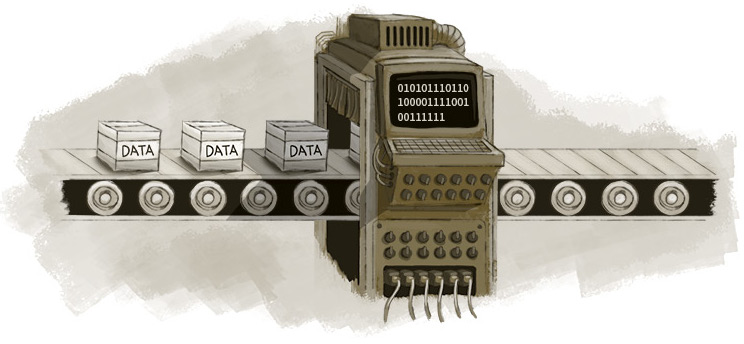

# Fundamentos da Lógica de Programação

Antes de aprender uma linguagem de programação, se torna necessário o domínio
da lógica de programação.
Este material é um resumo de cursos, leituras e pesquisas sobre o tema Lógica
de Programação e Algoritmos.

>	Everybody in this country should learn how to program a computer because it 
>	teaches you how to think.” – (Todo mundo neste país deveria aprender a 
>	programar porque isso te ensina a pensar) **Steve Jobs**.

A lógica de programação é quem nos dá as ferramentas necessárias para executar o processo mais básico no desenvolvimento de alguma aplicação: a criação de seu algoritmo.

Antes de criar um software, aplicaçao ou etc do zero, ou de resolver um problema de um já existente, é necessário descascá-lo até chegarmos ao seu núcleo. Como uma cebola .

Em outras palavras, precisamos compreendê-lo completamente, desde suas funções a seus objetivos finais. Para isso existe um processo que deve ser entendido, aprendido e aplicado ! 

## Parte 1
- [Narrativa Descritiva](https://github.com/nildoeti/fundamentos-da-logica-de-programacao/blob/main/narracao-descritiva/narracao-descritiva.md)

- Tópico I: Fundamentos da Lógica
	- Introdução ao curso
	- A solução estruturada de problemas do cotidiano
	- Representação formal da solução de problemas utilizando narrativa
	- Representação formal da solução de problemas utilizando fluxogramas
	- O pensamento estruturado aplicado à Informática, utilizando narrativa e fluxograma
	- Representação formal da solução de problemas de Informática utilizando Portugol

- Tópico II: Conceitos básicos de programação
	- Apresentação de dados para o usuário
	- Exercício Prático 01
	- Variáveis
	- Tipos de dados
	- Exercício Prático 02 
	- Constantes
	- Exercício Prático 03
	- Atribuição de Variáveis
	- Exercício Prático 04 
	- Operadores matemáticos
	- Exercício Prático 05
	- Precedência dos operadores
	- Comandos de entrada e de saída (ESCREVA / LEIA)
	- Exercício Prático 06 (15:44)
 	- Revisão geral do tópico

- Tópico III: Estruturas de controle
	- Estruturas de seleção
	- Seleção simples (SE)
	- Explicação de códigos (SE)
	- Seleção composta (SE .. SENÃO)
	- Exercício Prático 08
	- Seleção encadeada: estruturas seletivas aninhadas (SE .. SENÃO .. SE)
	- Exercício Prático 09
	- Seleção com múltiplas alternativas (ESCOLHA .. CASO)
	- Exercício Prático 10
	- Estruturas de repetição
	- Repetição com teste no início (ENQUANTO)
	- Exercício Prático 11
	- Repetição com teste no final (FAÇA .. ENQUANTO ou REPITA .. ATÉ)
	- Exercício Prático 12
	- Repetição com variável de controle (PARA)
	- Exercício Prático 13
