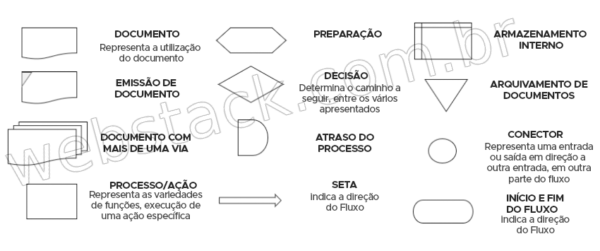
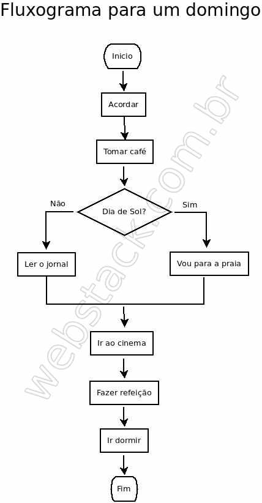

# Represetação da solução de um problema com uso de FLUXOGRAMA

[Fluxograma](https://pt.wikipedia.org/wiki/Fluxograma) é a representação do
processo ou algoritmo. É muito usado na construção de projeto de software, 
para representar a lógica interna do programa.
Portanto, o fluxograma é a criação de um desenho, que representa por exemplo, 
a parte lógica do funcionamento de um software.

Ajuda nos a:

- Desenhar a lógica

- Mostrar a sequência de informações;

	-	Sequências de passos são entrada, processamento e saida dos dados.

## Caracteristicas de um fluxograma:

Exemplo de um fluxograma que ilustra o dia a dia de domingo de uma pessoa.

Portanto, aqui visamos entender de forma clara e simples, de como podemos 
usar fluxogramas para expressar as funcionalidades de um programa.
Ao longo do treinamento, estaremos criando fluxogramas mais sofisticados, e que
vai nos ajudar a entender melhor o funcionamento da lógica de programação.